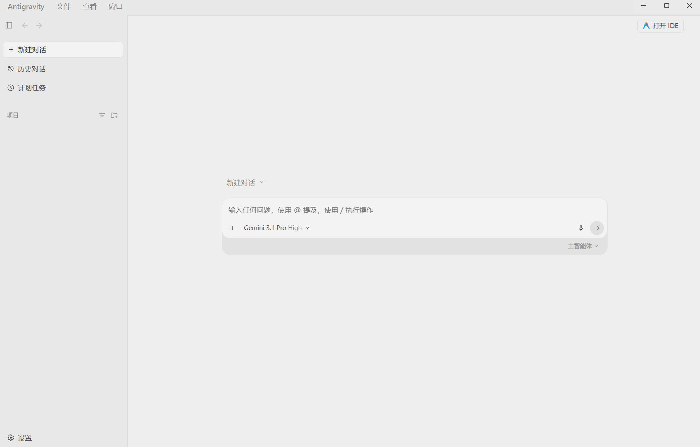

# Antigravity-zh-CN

<div align="center">

**🌏 [English](README_EN.md) | 简体中文**

一个为 Google Antigravity 桌面端提供完整中文界面的开源汉化补丁

[](https://opensource.org/licenses/MIT)
[](https://www.python.org/downloads/)
[](https://www.microsoft.com/windows)

</div>

---

## 📖 项目简介

**Antigravity v2.8.1 一键汉化补丁** - 为 Google Antigravity 桌面端提供完整的中文界面支持。

本项目采用独创的 **Web 注入与原生 ASAR 解包技术**，在完全不破坏原版软件安全性和稳定性的前提下，实现了目前技术上限内的最完美汉化。

## ✨ 核心特性

- 🚀 **零依赖 (Zero Dependencies)** - 自带纯原生 Python 编写的 ASAR 解析与打包算法，无需安装 Node.js，无需 npm，无需 `asar` 命令行工具
- 🎯 **智能文本匹配** - 采用底层 `indexOf` 碎片化重组与 CSS 伪类多态匹配策略，完美绕过 Webpack 代码分割导致的汉化失效问题
- ⚡ **一键部署** - 执行补丁后自动清理进程并重启软件，实现"敲下回车 → 享受中文"的无缝体验
- 🛡️ **纯净可逆** - 还原脚本可彻底抹除所有汉化残留，确保随时能"无损回滚"至纯血官方英文版
- 🧭 **全动态路径寻址** - 采用 `LOCALAPPDATA` 动态寻址，支持任意 Windows 系统配置

## 📦 下载与安装

### 方式一：EXE 独立免安装版 ⭐ 推荐普通用户

**下载：** [Antigravity-zh-CN-v2.8.1-Windows-x64-exe.zip](https://github.com/MIMICTE/Antigravity-zh-CN/releases/latest)

**特点：**
- ✅ 开箱即用，**无需安装 Python** 环境
- ✅ 内置官方 Antigravity 高清图标，原生软件级体验
- ✅ 双击直接运行即可完成汉化或还原

**使用方法：**
1. 下载并解压 ZIP 文件
2. 双击运行 `Antigravity-Patcher.exe` 开始汉化
3. 如需还原，双击运行 `Restore.exe` 即可一键恢复为官方英文版

---

### 方式二：Python 脚本版 ⭐ 推荐已有 Python 环境用户

**下载：** [Antigravity-zh-CN-v2.8.1-Windows-x64.zip](https://github.com/MIMICTE/Antigravity-zh-CN/releases/latest)

**特点：**
- ✅ 开源透明，可随时审查代码
- ✅ 文件极其小巧（仅约 60 KB）
- ✅ 不会被任何杀毒软件误报

**前置要求：**

确保已安装 [Python 3.8 及以上版本](https://www.python.org/downloads/)
- 安装时请务必勾选 **"Add Python to PATH"** 选项

**使用方法：**
1. 下载并解压 ZIP 文件
2. 双击运行 `Antigravity-Patcher.py` 开始汉化

脚本会自动：
- 关闭 Antigravity 进程
- 解包并注入汉化代码  
- 重启软件并应用中文界面

3. 双击运行 `Restore.py` 一键恢复为官方英文版

> 💡 **提示**：如果双击无法运行 Python 脚本，请尝试：
> - 右键选择 "打开方式" → "Python"
> - 或在项目目录打开命令行执行：
>   ```bash
>   python Antigravity-Patcher.py  # 汉化
>   python Restore.py              # 还原
>   ```

---

### 方式三：从源码安装 ⭐ 推荐开发者

**克隆仓库：**
```bash
git clone https://github.com/MIMICTE/Antigravity-zh-CN.git
cd Antigravity-zh-CN
python Antigravity-Patcher.py
```

**或下载源码压缩包：**

从 [Releases 页面](https://github.com/MIMICTE/Antigravity-zh-CN/releases/latest) 下载 `Source code (zip)` 或 `Source code (tar.gz)`，解压后运行 `Antigravity-Patcher.py`。

## 💡 技术原理

本项目利用 Electron 框架机制实现汉化：

### 1. 免打包劫持 (Unpacked Patching)
禁用官方 `app.asar` 文件，迫使软件读取注入了汉化代码的解包 `app` 文件夹。

### 2. 动态 DOM 拦截 (Dynamic DOM Interception)
在 `preload.js` 中注入 `MutationObserver`，实时监控页面 DOM 变化并替换英文文本为中文。

### 3. 原生 ASAR 解析器
使用纯 Python 实现的 ASAR 文件格式解析器，零外部依赖。

## ⚠️ 已知限制

- **思考日志为英文** - 受限于大模型的即时流式输出架构，智能体后台生成的思考日志（`Thought` 过程）无法汉化，但所有最终回复与前端界面均已 100% 汉化
- **仅支持 Windows** - 目前仅适配 Windows 平台，macOS 和 Linux 需要单独适配
- **版本依赖** - 针对 Antigravity v2.8.1 深度优化，其他版本亦具备高度兼容性

## 📸 效果展示

<div align="center">



*汉化后的 Antigravity 界面 - 所有文本已完全汉化*

</div>

**界面完全汉化包括：**
- ✅ 侧边栏菜单（新建对话、历史对话、计划任务、项目）
- ✅ 顶部导航栏（文件、音频、窗口）
- ✅ 输入框提示文本和模型选择器
- ✅ 设置页面所有选项和说明

> 💡 提示：要查看实际效果，双击运行 `Antigravity-Patcher.exe` 或 `Antigravity-Patcher.py` 即可体验完整的中文界面！

## 🔐 安全性说明

本项目是完全开源和安全的：

### ✅ 我们做了什么

- **仅修改界面文本** - 只在前端层面替换显示文本，不涉及网络通信、数据收集、账号信息访问
- **开源透明** - 所有代码完全开源，无混淆、无加密、无隐藏逻辑
- **可逆操作** - 提供完整的还原机制，一键恢复原版
- **零外部依赖** - 纯 Python 标准库实现，不连接外部服务器

### 🛡️ 技术原理

1. **ASAR 解包** - 使用纯 Python 解析 Electron 的 ASAR 打包格式
2. **代码注入** - 在 `preload.js` 和 `menu.js` 中追加翻译代码
3. **DOM 监听** - 使用 `MutationObserver` 监听页面变化
4. **文本替换** - 通过字典匹配将英文替换为中文

### 关于 .exe 版本

- .exe 文件使用 [PyInstaller](https://pyinstaller.org/) 开源工具打包
- 包含完整的 Python 运行时环境（因此文件较大约 8 MB）
- 可能被部分杀毒软件误报，这是 PyInstaller 的已知问题
- 如有安全顾虑，推荐使用 Python 脚本版（代码完全透明）

整个过程不涉及任何逆向工程或破解行为。

## ❓ 常见问题

<details>
<summary><b>Q: Python 脚本版和 .exe 版本有什么区别？</b></summary>

A: 
- **Python 脚本版**：需要 Python 环境，文件小，代码透明
- **.exe 版本**：无需 Python，开箱即用，但文件较大且可能误报

两者功能完全相同，推荐根据自己的需求选择。
</details>

<details>
<summary><b>Q: 为什么 .exe 文件这么大？</b></summary>

A: .exe 文件包含了完整的 Python 运行时环境，所以约 8 MB 是正常的。
</details>

<details>
<summary><b>Q: 杀毒软件报毒怎么办？</b></summary>

A: 这是 PyInstaller 打包的已知问题，非真实病毒。可以：
- 添加到杀毒软件白名单
- 使用 Python 脚本版代替（推荐）
- 上传到 [VirusTotal](https://www.virustotal.com/) 验证
</details>

<details>
<summary><b>Q: 为什么执行脚本时提示 "Python 不是内部或外部命令"？</b></summary>

A: 这说明 Python 没有添加到系统环境变量中。请重新安装 Python，并在安装时勾选 "Add Python to PATH" 选项，或者直接使用无需 Python 环境的 `.exe` 版本。
</details>

<details>
<summary><b>Q: 执行汉化后软件无法启动怎么办？</b></summary>

A: 请尝试以下步骤：
1. 执行 `Restore.exe` 或 `Restore.py` 还原到原版
2. 确保 Antigravity 原版能正常运行
3. 检查是否有杀毒软件阻止了脚本执行
4. 以管理员身份运行脚本
</details>

<details>
<summary><b>Q: 汉化后部分界面仍然是英文？</b></summary>

A: 这是正常现象。由于以下原因，部分内容无法汉化：
- AI 思考日志（Thought）需要保持英文以确保模型稳定性
- 动态生成的内容可能未被词典覆盖
- 欢迎提交 Issue 报告遗漏的翻译
</details>

<details>
<summary><b>Q: 软件更新后汉化失效了怎么办？</b></summary>

A: Antigravity 更新可能会覆盖汉化文件。请：
1. 执行 `Restore.exe` 或 `Restore.py` 清理旧版本汉化
2. 等待本项目更新以支持新版本
3. 或者在新版本上重新执行汉化脚本（可能不稳定）
</details>

<details>
<summary><b>Q: 这个补丁会影响软件的安全性吗？</b></summary>

A: 不会。本补丁仅修改界面文本显示，不涉及网络通信、数据加密、账号认证、核心功能逻辑。所有修改都在前端层面，不影响软件与服务器的通信。
</details>

<details>
<summary><b>Q: 如何添加新的翻译？</b></summary>

A: 编辑 `Antigravity-Patcher.py` 文件中的 `dictionary` 字典，添加键值对：
```python
"English Text": "中文翻译",
```
然后重新执行汉化脚本。
</details>

<details>
<summary><b>Q: 支持其他操作系统吗？</b></summary>

A: 目前仅支持 Windows。macOS 和 Linux 版本的路径和机制不同，需要单独适配。
</details>

更多问题？欢迎在 [GitHub Issues](../../issues) 或 [Discussions](../../discussions) 中提问！

## 🤝 参与贡献

欢迎提交 Issue 和 Pull Request！

- 发现翻译错误或遗漏？请提交 [Issue](../../issues) 或直接 PR 修改
- 有更好的技术方案？欢迎在 [Discussions](../../discussions) 讨论

详细的贡献指南请查看 [CONTRIBUTING.md](CONTRIBUTING.md)

## 📄 许可证

本项目采用 [MIT License](LICENSE) 开源协议。

## ⚠️ 免责声明

- 本项目仅供学习交流使用
- 使用本补丁造成的任何问题由用户自行承担
- 请使用正版 Antigravity 软件
- 请遵守 Antigravity 的服务条款

## 🌟 Star History

如果这个项目对你有帮助，请考虑给它一个 Star ⭐️

## 📧 联系方式

- Issues: [GitHub Issues](../../issues)
- Discussions: [GitHub Discussions](../../discussions)

---

<div align="center">

**Made with ❤️ by Antigravity-zh-CN Contributors**

</div>
